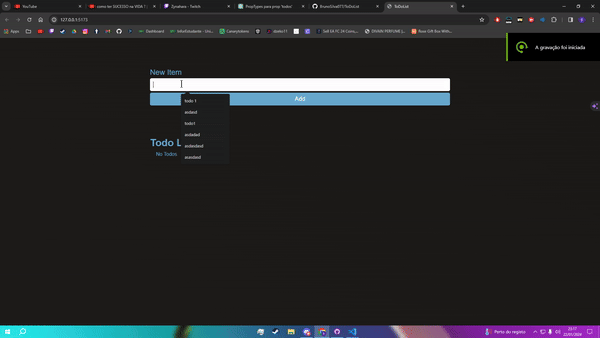

# ToDoList React App

This is a simple ToDoList application developed in React.




## Getting Started

### Prerequisites

Make sure you have Node.js installed on your machine.

- [Node.js](https://nodejs.org/)

### Cloning and Setup

1. Clone the repository to your local machine.

   ```bash
   git clone https://github.com/BrunoSilva077/ToDoList.git
   
2. Navigate to the project directory.

   ```bash
   cd ToDoList
   
3. Install project dependencies using npm or yarn.

   ```bash
    npm install
    # or
    yarn

4. Run the application in development mode.

     ```bash
    npm start
    # or
    yarn start
     
### Usage

Once the application is running, open your browser and navigate to [http://localhost:5275](http://localhost:5275) to view the ToDoList app. You can add new tasks, mark them as completed, and delete them as needed.

